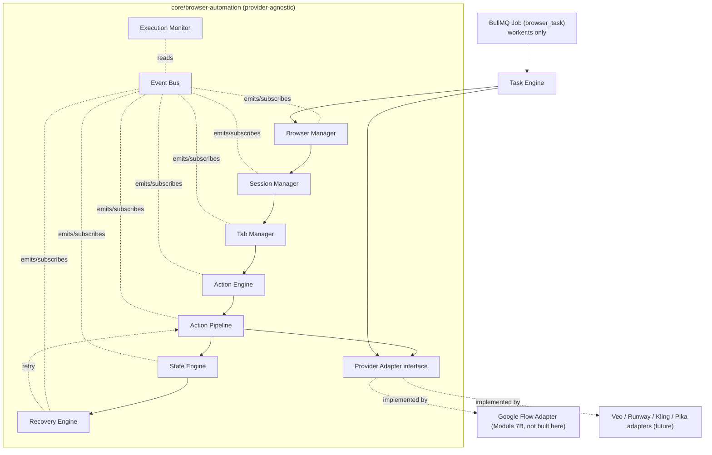
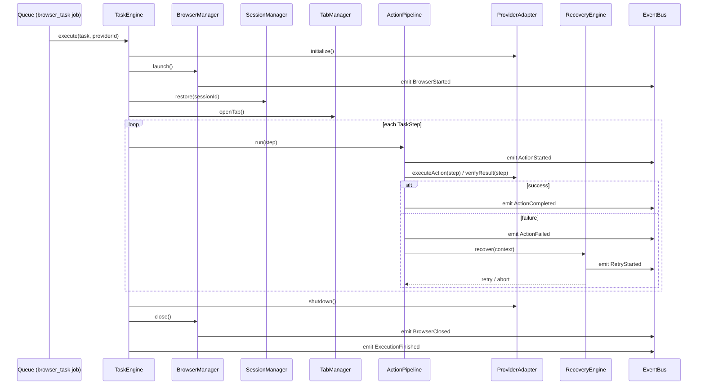
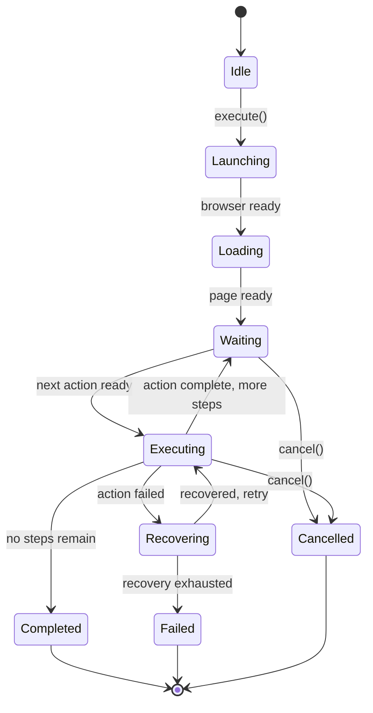

# Module 7A — Browser Automation Framework: Audit, Design & Interfaces

Scope: a **provider-agnostic** execution engine for browser-driven AI tools — capable of running
Google Flow, Veo, Runway, Kling, Pika, or "any browser application" without architectural change.
This document is steps 1–5 of the requested implementation strategy (audit, integration points,
design, diagrams, interfaces); code follows in the same delivery, per Module 6's precedent.

**This module contains zero Google Flow logic, zero selectors, zero provider-specific code.**
Module 7B (a future module) implements the actual Google Flow provider *using* this framework.

## 1. Audit — what already exists, and why it's not reused here

Module 4 (`core/automation/`) already has a working, narrow browser automation path:
`browser-session.ts` (storageState-based Playwright session), `google-flow-driver.ts` (a single
hardcoded step sequence), `selectors.ts` (Flow-specific CSS/text selectors), `errors.ts`
(`AutomationCircuitBreakerError`). It's wired into one job type (`scene_video_auto`), one provider
(`google-flow-automated.ts`), registered only in `core/queue/worker-only-processors.ts`.

**Module 4 is untouched by this module** — "DO NOT modify previous modules unless integration
requires it," and Module 4's own Flow automation isn't being migrated here (that's the explicit
job of the future Module 7B, which will build a real `ProviderAdapter` for Flow — possibly on top
of this framework, possibly replacing Module 4's ad-hoc version — a decision left to that module).
What Module 4 *does* establish, and this module reuses the precedent of rather than the code of:

| Precedent from Module 4 | How 7A reuses the precedent |
|---|---|
| Playwright must never reach a Vercel serverless function | Same isolation strategy: a new `browser_task` job type, registered only in `core/queue/worker-only-processors.ts`, which only `worker.ts` imports |
| Google login is never automated — a one-time manual `storageState()` export | The generic `SessionManager` only ever *restores* a session; nothing in this framework performs a login flow |
| Circuit breaker → graceful degrade, never blind retry | Generalized into the `RecoveryEngine` + `ActionPipeline`'s `Failure → Recovery → Retry` step, provider-agnostic |
| Playwright dependency already in `package.json` (Module 4) | Reused as-is — no new browser-automation dependency needed |

## 2. Integration points

- **Queue (Module 3/4 precedent).** A new `browser_task` `JobType`, processed only by a
  worker-only processor (`core/queue/processors/browser-task.processor.ts`), added to
  `core/queue/worker-only-processors.ts` alongside `scene_video_auto` — the only touch to a
  previous module's *file* (one registry line), justified because queue integration is explicitly
  requested ("Connect with the existing Scene Queue... Queue → Task → Browser Framework → Provider
  Adapter").
- **AI Production Engine (Module 6).** `ProductionProfile.render.providerOverrides` already
  reserves a per-capability provider id slot as "abstraction only, not yet consumed" (Module 6's
  explicit scope boundary) — a future browser-automation-backed `VideoProvider` would read from
  there. Not wired in this module either; still an abstraction.
- **Scene Queue → Browser Task**, conceptually: a Scene *could* become a `BrowserTask`, but
  building that mapping requires knowing what actions to take (upload which reference, paste what
  prompt, click which button) — that's provider-specific by definition and explicitly out of scope
  here. This module stops at the generic `TaskEngine.execute(task, providerId)` entry point; a
  future provider adapter is what would translate a Scene into a `BrowserTask`.
- **No changes to**: `core/automation/*` (Module 4), `core/ai/*` (provider registry), any Module
  1–6 model or service, any existing UI page.

## 3. Architecture





## 4. State machine (State Engine)



State is persisted (via an injected `StateStore`, not hardcoded to Mongo — see §5) after every
transition, so a `BrowserTaskRun` can be resumed after a process restart: `TaskEngine.resume(runId)`
reloads the last persisted state and continues from the next unexecuted step, rather than
restarting the whole task.

## 5. Interfaces

Every class below is designed for dependency injection — persistence, browser control, and
provider logic are all interfaces the framework depends on, never concrete implementations it
owns. The Mongo-backed store implementations live in `modules/browser-automation/` (§7), not in
`core/browser-automation/` itself, so the framework has zero database coupling.

```ts
// core/browser-automation/types.ts

export type ActionType =
  | "navigate" | "click" | "double_click" | "right_click" | "hover"
  | "input_text" | "paste" | "keyboard_shortcut"
  | "upload_file" | "download_file"
  | "scroll" | "drag" | "wait" | "sleep"
  | "screenshot" | "capture_html" | "capture_dom";

export interface TaskStep {
  id: string;
  action: ActionType;
  params: Record<string, unknown>;      // action-specific, e.g. { selector, text } for input_text
  verify?: { type: "selector_visible" | "url_matches" | "custom"; params: Record<string, unknown> };
  timeoutMs?: number;
  retryable?: boolean;                   // default true
}

/** Serializable — a BrowserTask can be stored as plain JSON (BrowserTaskRun.taskDefinition, §7). */
export interface BrowserTask {
  id: string;
  providerId: string;
  sessionId?: string;                    // which persisted session to restore, if any
  steps: TaskStep[];
  metadata?: Record<string, unknown>;    // provider-defined, opaque to the framework
}

export type ExecutionState =
  | "idle" | "launching" | "loading" | "waiting"
  | "executing" | "recovering" | "completed" | "failed" | "cancelled";

export interface TaskResult {
  taskId: string;
  state: ExecutionState;
  completedSteps: number;
  totalSteps: number;
  error?: string;
  downloads: { path: string; url?: string }[];
  screenshots: string[];
}
```

```ts
// core/browser-automation/event-bus.ts

export type BrowserAutomationEvent =
  | "BrowserStarted" | "BrowserClosed"
  | "PageLoaded"
  | "ActionStarted" | "ActionCompleted" | "ActionFailed"
  | "RetryStarted"
  | "DownloadCompleted"
  | "ExecutionFinished";

export interface EventPayload {
  runId: string;
  event: BrowserAutomationEvent;
  timestamp: Date;
  data?: Record<string, unknown>;
}

export interface BrowserAutomationEventBus {
  emit(payload: EventPayload): void;
  on(event: BrowserAutomationEvent, handler: (payload: EventPayload) => void): () => void; // returns unsubscribe
  onAny(handler: (payload: EventPayload) => void): () => void;
}
```

```ts
// core/browser-automation/session-manager.ts

/** Persistence-agnostic — the framework never talks to Mongo directly (Clean Architecture /
 * Dependency Injection, per the requested code quality bar). */
export interface SessionStore {
  load(sessionId: string): Promise<string | null>;   // Playwright storageState() JSON
  save(sessionId: string, storageStateJson: string): Promise<void>;
}

export interface SessionManager {
  restore(sessionId: string): Promise<{ storageState: unknown } | null>;
  persist(sessionId: string, context: import("playwright").BrowserContext): Promise<void>;
}
```

```ts
// core/browser-automation/browser-manager.ts

export interface BrowserManagerOptions {
  headless?: boolean;
  restartOnCrash?: boolean;
}

export interface BrowserManager {
  launch(options?: BrowserManagerOptions): Promise<void>;
  close(): Promise<void>;
  restart(): Promise<void>;
  isHealthy(): Promise<boolean>;
  getBrowser(): import("playwright").Browser | null;
}
```

```ts
// core/browser-automation/tab-manager.ts

export interface TabManager {
  openTab(context: import("playwright").BrowserContext): Promise<string>;   // returns tabId
  closeTab(tabId: string): Promise<void>;
  focus(tabId: string): Promise<void>;
  switchTo(tabId: string): Promise<import("playwright").Page>;
  refresh(tabId: string): Promise<void>;
  recover(tabId: string): Promise<import("playwright").Page>;               // re-opens if crashed
  activeTabId(): string | null;
}
```

```ts
// core/browser-automation/action-engine.ts

/** One method per ActionType — every action is reusable across any TaskStep/provider. */
export interface ActionEngine {
  navigate(page: import("playwright").Page, url: string): Promise<void>;
  click(page: import("playwright").Page, selector: string): Promise<void>;
  doubleClick(page: import("playwright").Page, selector: string): Promise<void>;
  rightClick(page: import("playwright").Page, selector: string): Promise<void>;
  hover(page: import("playwright").Page, selector: string): Promise<void>;
  inputText(page: import("playwright").Page, selector: string, text: string): Promise<void>;
  paste(page: import("playwright").Page, selector: string, text: string): Promise<void>;
  keyboardShortcut(page: import("playwright").Page, keys: string): Promise<void>;
  uploadFile(page: import("playwright").Page, selector: string, filePaths: string[]): Promise<void>;
  downloadFile(page: import("playwright").Page, triggerSelector: string): Promise<{ path: string }>;
  scroll(page: import("playwright").Page, selector?: string, deltaY?: number): Promise<void>;
  drag(page: import("playwright").Page, fromSelector: string, toSelector: string): Promise<void>;
  wait(page: import("playwright").Page, selector: string, timeoutMs?: number): Promise<void>;
  sleep(ms: number): Promise<void>;
  captureScreenshot(page: import("playwright").Page): Promise<string>;      // returns file path
  captureHtml(page: import("playwright").Page): Promise<string>;
  captureDom(page: import("playwright").Page): Promise<string>;             // serialized DOM snapshot
}
```

```ts
// core/browser-automation/action-pipeline.ts

export interface ActionPipelineResult {
  step: TaskStep;
  success: boolean;
  error?: string;
  attempts: number;
}

/** Validate -> Execute -> Verify -> Success|Failure->Recovery->Retry, per TaskStep. */
export interface ActionPipeline {
  run(page: import("playwright").Page, step: TaskStep): Promise<ActionPipelineResult>;
}
```

```ts
// core/browser-automation/state-engine.ts

export interface StateStore {
  load(runId: string): Promise<{ state: ExecutionState; currentStepIndex: number } | null>;
  save(runId: string, state: ExecutionState, currentStepIndex: number): Promise<void>;
}

export interface StateEngine {
  transition(runId: string, next: ExecutionState): Promise<void>;
  current(runId: string): Promise<ExecutionState>;
  resumePoint(runId: string): Promise<number>;  // step index to resume from
}
```

```ts
// core/browser-automation/recovery-engine.ts

export type RecoveryTrigger =
  | "browser_crash" | "page_crash" | "timeout" | "popup"
  | "lost_connection" | "unexpected_navigation";

export interface RecoveryContext {
  runId: string;
  trigger: RecoveryTrigger;
  step: TaskStep;
  attempt: number;
}

export type RecoveryAction = { type: "restart_browser" } | { type: "resume_state" } | { type: "retry_action" } | { type: "abort" };

export interface RecoveryEngine {
  recover(context: RecoveryContext): Promise<RecoveryAction>;
}
```

```ts
// core/browser-automation/execution-monitor.ts

export interface ExecutionSnapshot {
  runId: string;
  currentAction: string | null;
  executionTimeMs: number;
  retries: number;
  errors: string[];
  screenshots: string[];
  logs: { timestamp: Date; message: string }[];
}

export interface ExecutionMonitor {
  snapshot(runId: string): Promise<ExecutionSnapshot>;
  record(runId: string, entry: { level: "info" | "warn" | "error"; message: string; data?: unknown }): Promise<void>;
}
```

```ts
// core/browser-automation/provider-adapter.ts — the plugin contract every future provider implements

export interface ProviderAdapter {
  readonly id: string;
  readonly label: string;
  initialize(context: { page: import("playwright").Page; task: BrowserTask }): Promise<void>;
  validate(task: BrowserTask): Promise<{ valid: boolean; reason?: string }>;
  executeAction(page: import("playwright").Page, step: TaskStep, engine: ActionEngine): Promise<void>;
  verifyResult(page: import("playwright").Page, step: TaskStep): Promise<boolean>;
  recover(context: RecoveryContext): Promise<RecoveryAction>;
  shutdown(): Promise<void>;
}

/** Empty until Module 7B (or any future module) registers a real adapter — deliberately. */
export interface ProviderRegistry {
  register(adapter: ProviderAdapter): void;
  get(providerId: string): ProviderAdapter | undefined;
  list(): ProviderAdapter[];
}
```

```ts
// core/browser-automation/task-engine.ts — the single entry point that composes everything above

export interface TaskEngine {
  execute(task: BrowserTask): Promise<TaskResult>;
  resume(runId: string): Promise<TaskResult>;
  pause(runId: string): Promise<void>;
  cancel(runId: string): Promise<void>;
}
```

## 6. Persistence (`modules/browser-automation/`, outside the framework core)

| Collection | Purpose |
|---|---|
| `BrowserSession` | Persisted `storageState()` per `{userId, provider, label}` — generic, not tied to `GoogleAccount` (future providers won't all be "Google accounts") |
| `BrowserTaskRun` | One per execution: provider, serialized `BrowserTask`, `state`, `currentStepIndex`, timestamps, retryCount, downloads, screenshots |
| `BrowserExecutionLog` | Append-only log entries per run (info/warn/error), backs the Execution Monitor and dashboard |
| `BrowserProviderConfig` | Per-provider settings (timeouts, retry policy) — referenced, not duplicated, by any adapter |

`MongoSessionStore implements SessionStore` and `MongoStateStore implements StateStore` (both in
`modules/browser-automation/service.ts`) are the concrete implementations injected into
`SessionManager`/`StateEngine` at construction time — the framework in `core/browser-automation/`
never imports Mongoose.

## 7. Queue integration

A new `browser_task` `JobType`, processed by `core/queue/processors/browser-task.processor.ts`,
registered **only** in `core/queue/worker-only-processors.ts` (same isolation as Module 4's
`scene_video_auto` — confirmed via `next build` that Playwright never reaches a route bundle). The
processor loads a `BrowserTask` from `Job.payload`, looks up a `ProviderAdapter` from the
(currently empty) `ProviderRegistry`, and runs `TaskEngine.execute()`. With no adapter registered,
every `browser_task` job fails immediately with a clear "no provider registered for id X" error —
an honest, non-silent state, not a placeholder that pretends to work.

## 8. Status

Implemented in this delivery (7A): the framework (§5), persistence + queue integration (§6, §7),
REST API, and the Browser Automation Dashboard UI — all provider-agnostic, zero Flow logic, exactly
as scoped. Module 7B (Google Flow provider adapter, not part of this delivery) is the first real
consumer of `ProviderAdapter`.
